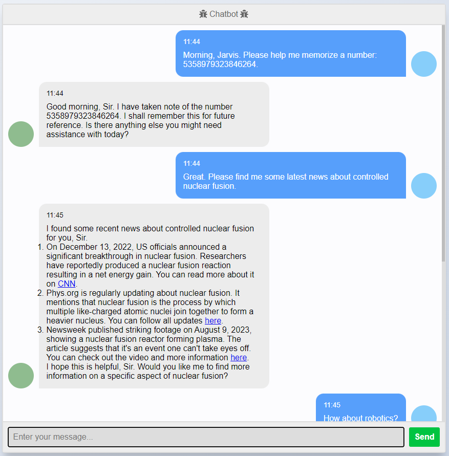
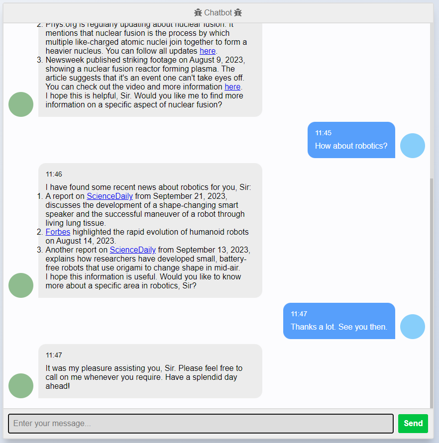
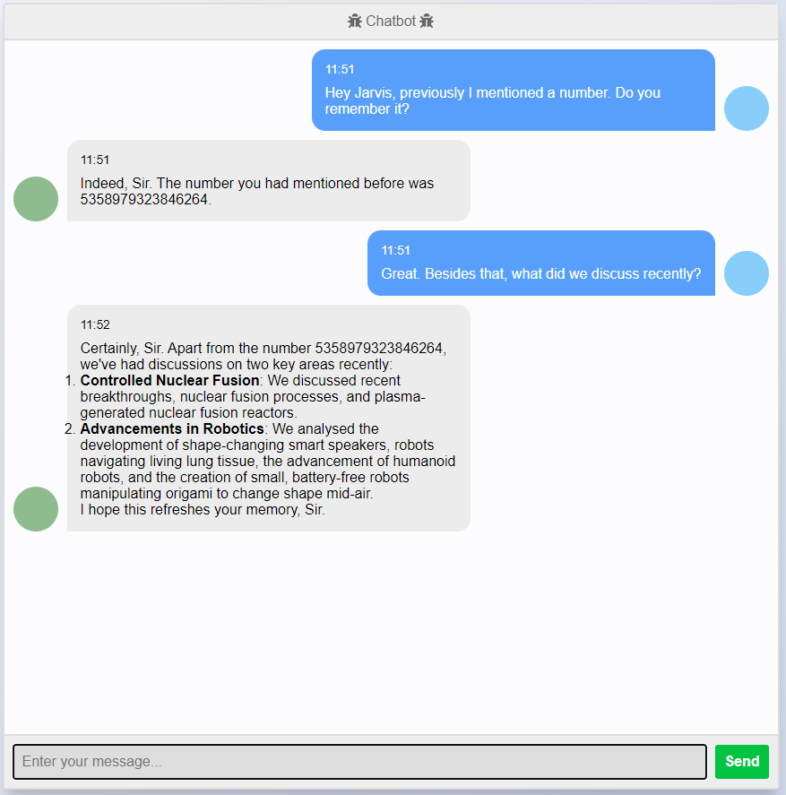

# OhBing

A NewBing-like chat bot with long-term memory.
Very preliminary, improvements are welcome.

Sample (chat history cleared before the third image):

  
  
  

Also a rough video in Chinese [here](https://www.bilibili.com/video/BV1Zj411b7rE).

## How it works?

It's based on OpenAI's text generation and embedding APIs.
When the user does not send any message for a while, the chat will be summarized into pieces, and stored with text embedding. The chat history is then cleared.

When replying to the user, the bot first retrieves relevant memories using cosine similarity along with some other metrics, 
and searches the Internet with appropriate keywords if necessary.
The retrieved memories and search results are then added to the prompt for reply generation.

You can also trigger a reflection (manually), which will try to generate insights from the memories, and add back to the memory to be used in future chats.

Summarization and reflection are inspired by [Generative Agents: Interactive Simulacra of Human Behavior](https://arxiv.org/abs/2304.03442).

Currently it is hard-coded to use gpt-3.5-turbo.
It has costed merely 4 RMB for testing and playing till now.
gpt-3.5-turbo makes mistakes frequently, but it's still fun to play with.
Try gpt-4 if you have enough money : \)

## Usage

1. Clone this repo;
2. Install required Python packages: `pip install -r requirements.txt`;
3. Install firefox-esr: `sudo add-apt-repository ppa:mozillateam/ppa && sudo apt install -y firefox-esr`. And install [geckodriver](https://github.com/mozilla/geckodriver) if you see compatibility warnings during launch;
4. Configure environment variables:
    - `OPENAI_API_BASE`: OpenAI API base URL, default to `https://api.openai.com/v1`;
    - `OPENAI_API_KEY`: OpenAI API key.
5. Run `python3 main.py <config_name> 127.0.0.1` to start the web server. Available configs can be found/added under `configs/`.
6. Open `http://127.0.0.1:5000` in your browser and start chatting.

Tips:
1. Access `http://127.0.0.1:5000/memory` to see the memory of the bot;
2. Access `http://127.0.0.1:5000/reflect` to trigger a reflection (it's slow, wait patiently);
3. Check `data/bots/<config_name>/log.log` for logs.
